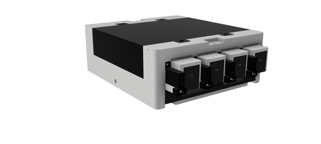
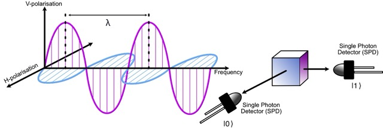
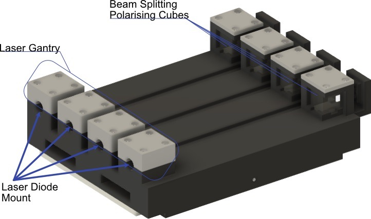
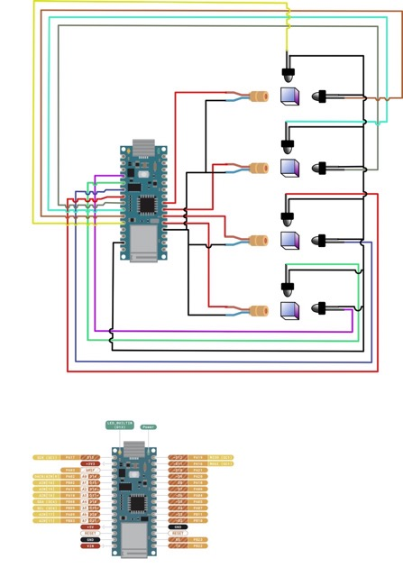
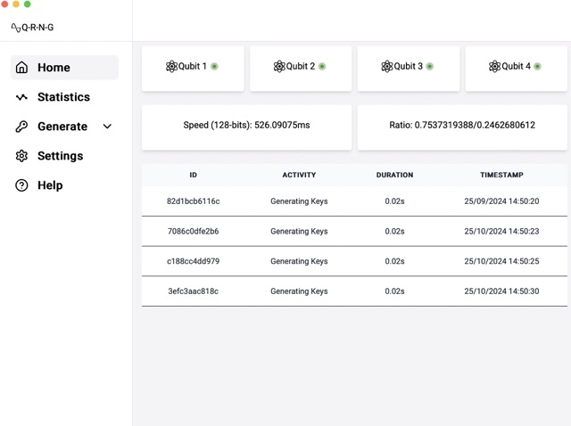

<p align="center">
  
</p>


<p align="center">
  
  
</p>


**⚠️ PLEASE WEAR LASER SAFETY GLASSES WHEN USING LASERS**

This repository is home to the firmware and hardware designs for a quantum random number generator (QRNG). 
The project components include a repository for a [command line interface (CLI)](https://github.com/KevinFasusi/qrng-cli), 
[graphical user interface (GUI)](https://github.com/KevinFasusi/qrng-gui) and [stochastic tests and analysis](https://github.com/KevinFasusi/qrng-notebooks) of the output. 

The QRNG is part of a project to explore and experiment with random numbers, cryptography and simulation. 

The repository hosts:

| Contents                                                    | Description                                                                                     |
|-------------------------------------------------------------|-------------------------------------------------------------------------------------------------|
| [CAD](https://github.com/KevinFasusi/qrng/cad)              | CAD files to print the enclosure and components.                                                |
| [Schematics](https://github.com/KevinFasusi/qrng/schematic) | Schematic for wiring the MCU controlling the laser diode gantry section and measurement section |
| [Code](https://github.com/KevinFasusi/qrng/cmd/maing.go)    | The firmware controlling the QRNG                                                               |

## 😎 Features

Use a truly random physical system to generate a stream of random bits as a source of entropy or 
use with the [CLI](https://github.com/KevinFasusi/qrng-cli) and [GUI](https://github.com/KevinFasusi/qrng-gui) to
convert the random bit stream to:

- initialisation vectors
- private keys
- integers
- hashes

## 🤔 Why?

~~I needed a legitimate reason to play with lasers~~ 

The inherent randomness of quantum mechanical systems makes them a useful source of entropy. 

 Random number generators (RNGs) are used in:

- **Cryptography**, where randomness is important for cryptographic primitives. Poor randomness is an attack vector and 
threatens confidentiality, integrity and availability. In cryptography randomness is used for generating salt, 
initialisation vectors (IV) private keys generator (asymmetric and symmetric cryptography) and selecting exponents in 
the Diffie-Hellman protocol to name a few. Randomness helps to make cryptographic primitives unguessable. However,
*"real"* randomness is hard to prove.
- **Simulations** when modelling complex systems such as natural phenomena, particle physics and in operations research.
- **Statistics** for applications randomly sampling from distributions.
- **Generative AI** and AI algorithms (random weights, seeds, mutations etc.).

Another big reason is simply out of curiosity, for exploration, experimentation and fun. Classical computers started as
big bulky mainframes. Quantum computers come in many flavours but the hardware is inaccessible due to complexity
(cryostats, shielding), size, expense, method of generating qubits (e.g. trapped ions and superconductors), environmental
requirements (super cooled, vacuum etc.) or miniaturisation using specifics substrates for fabrication of the circuits 
    onto wafers made from silicon nitrite (SiN) or{ indium phosphide} (InP).

Linear optics and photonics offer a somewhat accessible alternative. An optics breadboard provides a platform for 
accuracy and scientific rigor. However, they are relatively expensive and not very portable.

This QRNG project is impractical for rigorous scientific or commercial use. The hope is that
is a fun way to tinker with hardware for engineering a quantum computational system.

## 🤓 How?

The QRNG uses a photonics based quantum system. The explanation, provided here, is an
overview. I do not provide an indepth coverage of photonics, linear optics or quantum computing. 
For a more detailed treatment please refer to the resources section of the 
[wiki](https://www.github.com/KevinFasusi/qrng/wiki/Resources).

Dirac notation is used extensively in quantum computing and looks intimidating. For an introduction amenable to
someone with some knowledge of computer science, and not requiring a physics degree, read 
'Quantum Computer Science: An Introduction' ([reading list](https://www.github.com/KevinFasusi/qrng/wiki/Resources)).

For a classical system (the pcs, laptops and servers etc.), bits are represented by
two states either a $0$ or $1$. A classical computer uses sequences of zeroes and ones to
operate. The analogue of a bit in classical computing in quantum computing is the qubit and refers to the computation 
basis state represented in two-dimensional hilbert space $\mathcal{H}$:
$$\vert0\rangle=\begin{bmatrix} 1\\ 0 \end{bmatrix} \text{, }\vert1\rangle=\begin{bmatrix} 0\\ 1 \end{bmatrix}$$

A qubit is in a superposition with $\alpha$ and $\beta$ representing varying probabilities such that
$\psi=\alpha\vert 0\rangle +\beta\vert 1\rangle$. 

The QRNG presented here uses a laser diode gantry as the qubit generator. Each laser is a single photon source. The photon
provides the probabilistic amplitudes corresponding to two paths.

Using the laser as a photon source, the system is prepared in a superposition with horizontal ($H$) and vertical ($V$)
polarisation $(\vert H\rangle + \vert V\rangle)/\sqrt{2}$. 



A 50:50 polarised beam splitter (PBS) is used to encode the photon as a $0$ or $1$ depending on the path the photon 
takes. The measurement section uses a single photon detector (SPD) along each axis of photo resistors 
(new model replaces with photodiodes) two for each qubit "wire" for horizontal and vertical encoding. 
The measurement section is responsible for the decoherence of the quantum system.



## 🛠️  Fabrication, installation and assembly instructions

The QRNG uses the 'Arduino IoT 33'. Other boards will be supported, however, due to the number of analogue pins required 
a multiplexer will be necessary.

The full build will be available in the [wiki](https://github.com/KevinFasusi/qrng/wiki/Build).
The build instructions will include the electronics, enclosure and assembly.

A wiring diagram for the arduino IoT 33 can be seen below:



The installation process has three components the QRNG firmware, cli and gui. The QRNG firmware can be used without the
other two components. However, the output of the generator must be viewed via the terminal using `tinygo monitor`,
`python3 -m serial.tools.miniterm /dev/tty<your specific usb port>` or some other method to view read UART output 
(e.g. minicom etc.)

### Firmware
Build from source by cloning the repository:

```shell
$ git clone https://github.com/KevinFasusi/qrng
```

To flash the firmware to the arduino nano 33 IoT use:

```shell
$ tinygo flash -target=arduino-nano33 -port=/dev/<the usb device>
```

Replace `<the usb device>` with the correct device on your system e,g. `ttyUSB0`.

### FPGA

A field programmable gate array (FPGA) is used to offload some of the processing including:

- frequency counts and distribution
- Von-Neuman skew correction

The FPGA used in this project is the iCEStick. Any FPGA supported by [apio](https://github.com/FPGAwars/apio) (a python 
project) will work, with the relevant changes to the `.ini` file and component assignment file `.pcf`.

First create a virtual environment and install apio. Follow the instructions 
[here](https://github.com/FPGAwars/apio/wiki/Installation) to install.

Once apio is available continue with verifying the design:

```shell
$ apio verify
```

Building the circuits:

```shell 
$ apio build
```

Uploading to the FPGA:

```shell
$ apio upload
```

Please see schematic for wiring the FPGA to the MCU (TBC)

## Generator output

The generator outputs several data points including:

- the raw reading for the single photon detector (SPD) per qubit generator (laser pulse)
- the state measured by the SPD
- a 32-bit (little endian) 
- a summary of all bits generated, broken down into number of zeros and ones and the ratio
- the time required to generate a 128-bit nonce in milliseconds

To monitor the output of the generator without the cli or gui, use:

```shell
$ tinygo monitor
```

or redirect the generator output to a file using:

```shell
$ tinygo monitor >> output.bin
```

alternatively use the serial tool miniterm provided with python (replace `<usb-device>` with the appropriate device):

```shell
$ python3 -m serial.tools.miniterm /dev/tty<usb-devcie>
```
Raw output (with tinygo monitor or miniterm):

```
Summary(Total Bits Generated: 128592    0: 121407	1: 7185)
Q1 -> SPD1 VERTICAL   |1>: 7424
Q1 -> SPD1 HORIZONTAL |0>: 7664
Q1-STATE:  0
Q2 -> SPD2 VERTICAL   |1>: 25520
Q2 -> SPD2 HORIZONTAL |0>: 25264
Q2-STATE:  1
Q3 -> SPD3 VERTICAL   |1>: 58304
Q3 -> SPD3 HORIZONTAL |0>: 65520
Q3-STATE:  0
Q4 -> SPD4 VERTICAL   |1>: 21248
Q4 -> SPD4 HORIZONTAL |0>: 22064
Q4-STATE:  0
00000000
00000000
00000000
00000000
00000000
01000000
00000000
00000000
```
However, the cli and gui provide more control and visibility of the QRNG output. 

### Command line interface

The QRNG has a command line interface (CLI) utility to view the output of the generator in realtime. The CLI supports 
various commands and outputs. See the [QRNG-CLI repository for more details](http://www.github.com/KevinFasusi/qrng-cli)

```shell
$ qrng stats --device "/dev/tty <usb-device>"  
```
The realtime output counts the total number of bits generated, the count for each binary output and the ratio.

```output
Total: 40696  0: 34173 1: 6523 0/1: 0.8397139768/0.1602860232                                                                                              
```

### Graphical user interface

The QRNG can be monitored and used via a cross-platform (Windows, Linux. and MacOs) 
[graphical user interface](https://github.com/KevinFasusi/qrng-gui).



## 🫤 Known issues / limitations

- This method is not fast by any stretch of the imagination. Using the MCU, we are generating random bits at 
significantly less than 1Mbps. To "go faster", we would need to use detectors connected to an ADC directly feeding the FPGA.
- The current setup has not passed a [dieharder](https://webhome.phy.duke.edu/~rgb/General/dieharder.php) test for
randomness. The test was conducted with insufficient data and parsed a file as input instead of the preferred method, 
piping the generators output directly to a running instance of the dieharder utility. More details can be found
  on the [wiki](https://github.com/KevinFasusi/qrng/wiki/Random).
- The v1.0 enclosure was designed to mount photo resistors not diode. The project code is implemented for 
photodiode. Photodiodes were also used in the [solderless breadboard setup](https://github.com/KevinFasusi/qrng/wiki/Build). 
The v2.0 enclosure will be changed to house photodiode.
- Printing the enclosure using PLA leads to less than perfect alignment of the laser gantry (qubit source) and the 
measurement section (PBS and SPDs) due to possible warping and printer tolerances. Your mileage may vary, depending on the
quality of your 3d printer and printer environment. When placing the emitter caps on each laser, in some instances 
care has to be taken to align with the laser to ensure the beam falls centre of the opposite PBS.
- The quality of the beam splitter may cause misalignment. Some PBS cubes may not split the light perfectly 45° center 
on orthogonal paths. Damage to the PBS can also cause problems with detection.
- Test results shared here only verify the generator under test (GUT). Each implementation of the QRNG will not be 
identical, due to variance in components, assembly and alignment. All implementations will have to confirm the generator
passes the tests for randomness independently.
- The number of lasers and polarising cubes, single photon detectors (SPDs) and analogue pins required make this setup 
not suitable for scale.
- I am not a physicist
